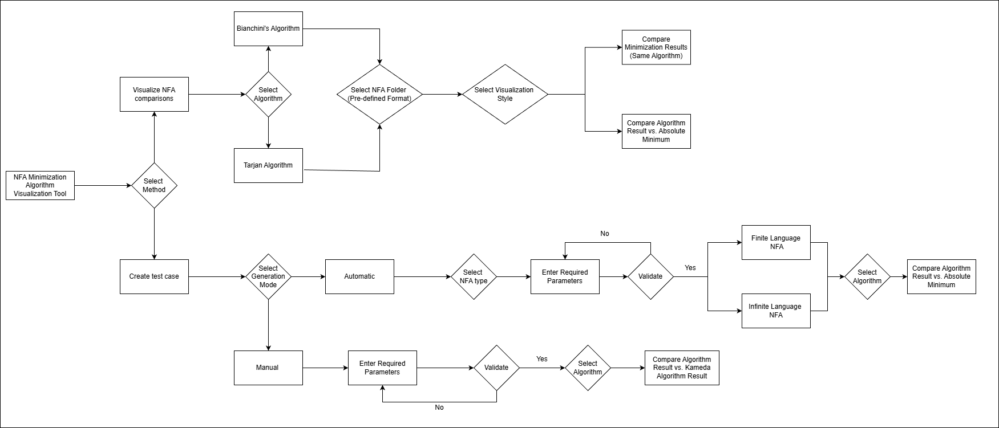
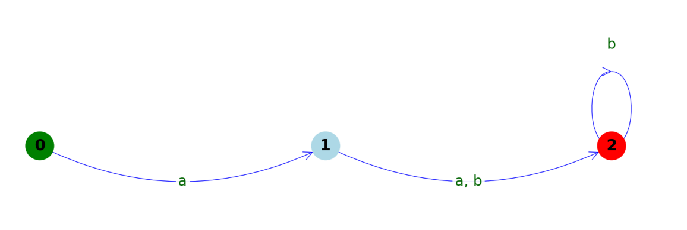
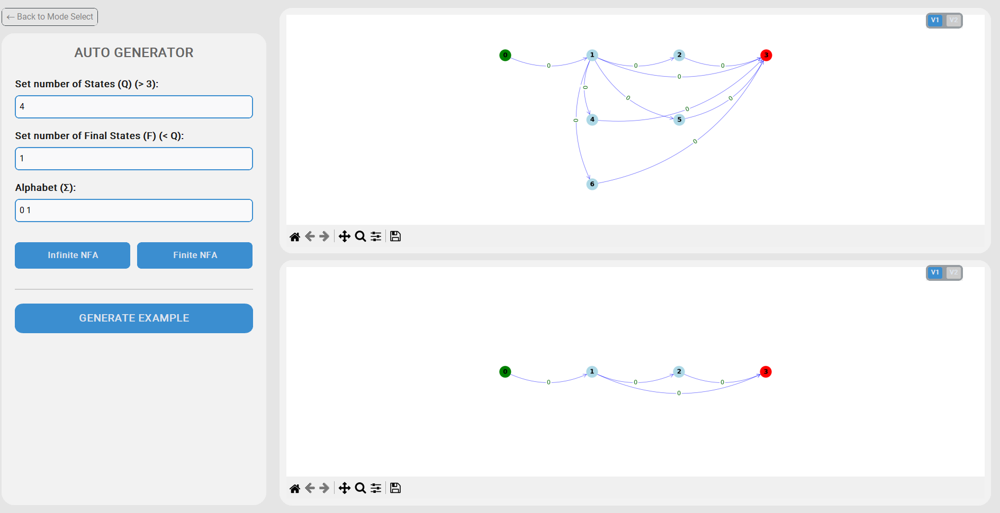
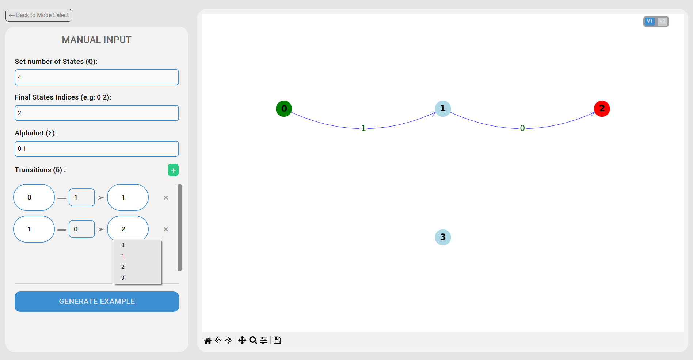

# NFA Minimization - Visualize NFA
# Programming Language: Python (3.13.9)
# Author: Phan Van Khai

# Tool: dist\NFA Mimimization.exe
# Usage
## Workflow

## Folder Structure for Comparison Tests
- The folder may contain one or more .txt test files.
- Each file may contain one or two NFAs. This implies that the test file must contain a minimum of 1 NFA and a maximum of 4 NFAs (consisting of 2 input NFAs and their 2 corresponding absolute minimums). The sequence in the file is as follows: "1st NFA", "Minimized version of 1st NFA", "2nd NFA", "Minimized version of 2nd NFA". Each NFA is separated by a **empty line**. If an NFA is **missing**, its place is **substituted** by an additional **empty line**.
- NFA Structure Definition
    - The NFA structure consists of $n$ states and $m$ transitions, defined as follows:
        - 1st Line: Contains the number of states ($n$).
        - 2nd Line: Contains the characters of the alphabet ($\Sigma$).
        - 3rd Line: Contains the final states $F$ (where $F \in \{0 \to n-1\}$).
        - Next $m$ lines: Define the transitions ($\delta$). Each line consists of a tuple with 3 parameters:
            - Source state ($q \in \{0 \to n-1\}$)
            - The index of the transition character in the alphabet ($(i, x \in \Sigma \lor \Sigma[i] = x)$)
            - Target state ($p \in \{0 \to n-1\}$)
    - Example:
        ```text
            3
            a b
            2
            0 1 0
            1 2 0
            1 2 1
            2 2 1

    
    
## Create test case
**1. Automatic NFA Generation**
* Input the number of states $n$ (requires $n > 3$).
* Input the number of final states $n_f$ (where $0 < n_f < n$).
* Input the alphabet symbols (**numeric characters only**).
* Select the generation mode: **Finite Language** or **Infinite Language**.



**2. Manual NFA Creation**
* Input the number of states $n$ (requires $n > 4$).
* Specify the final states ($F \in \{0 \to n-1\}$).
* Input the alphabet symbols (**numeric characters only**).
* Manually define the transitions.



## Installation
```bash
pip install -r requirements.txt
python -m PyInstaller --onefile --noconsole --add-data "gui;gui" --add-data "core;core" --hidden-import=customtkinter --hidden-import=PIL --hidden-import=PIL._tkinter_finder --hidden-import=gui.app_gui --name="NFA Mimimization" main.py
